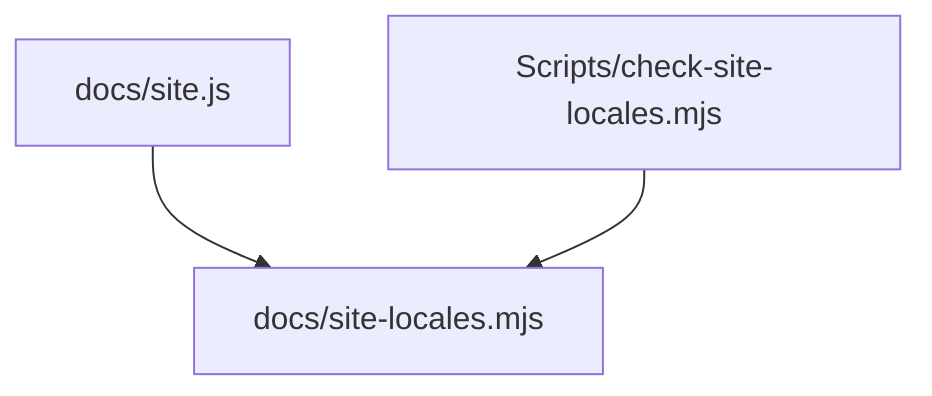

### Codegraph cục bộ

- Nguồn: 33 tệp mã; 2 liên kết import cục bộ.
- Hiển thị: 2/2 liên kết theo thứ tự ổn định.
- Phạm vi: chỉ import resolve được trong project; package ngoài không được đưa vào context.

