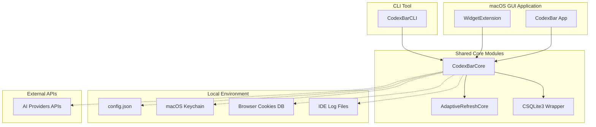
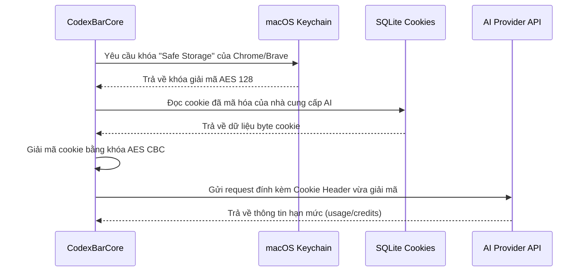
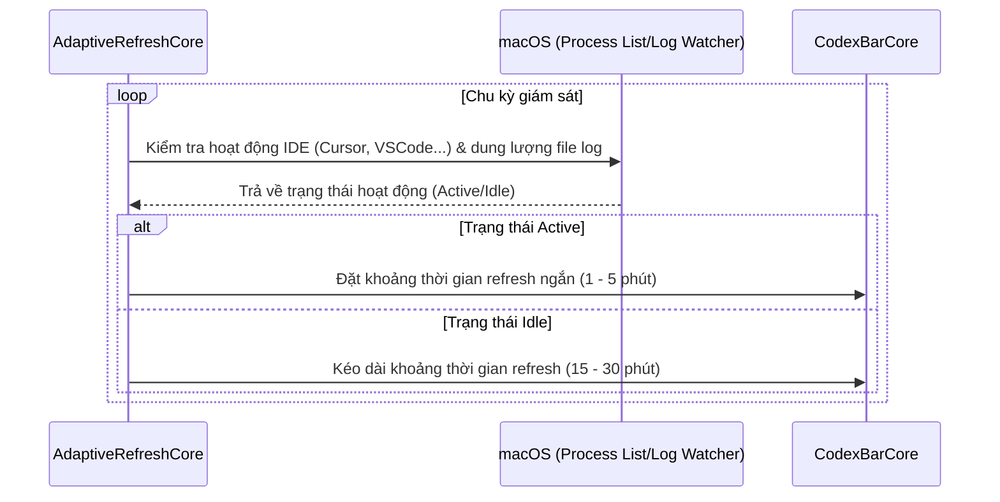

# ARCH.md — CodexBar

> Sinh từ [SPEC.md](SPEC.md).

## 1. Tổng quan Kiến trúc phần mềm

Dự án CodexBar được thiết kế theo cấu trúc modular hóa bằng Swift, chia nhỏ thành các Target chuyên biệt để dễ phát triển, tái sử dụng code giữa ứng dụng GUI (macOS) và CLI (macOS/Linux).

---

## 2. Mô tả các Target/Module chính

* **`CodexBar`**: Target ứng dụng GUI chính chạy trên thanh menu macOS. Chịu trách nhiệm render UI popover, quản lý các cửa sổ settings, thông báo đẩy (notifications), và hiệu ứng confetti.
* **`CodexBarCLI`**: Phiên bản dòng lệnh của ứng dụng. Đóng gói thành một binary độc lập (`codexbar`) giúp người dùng tích hợp với các môi trường phi đồ họa.
* **`CodexBarCore`**: Thư viện lõi chứa toàn bộ logic xử lý chính:
  * Đọc và ghi tệp cấu hình `config.json`.
  * Giao tiếp với Keychain để lấy mã hóa Safe Storage.
  * Parser phân tích cookie nhị phân (Safari) và SQLite cookie (Chrome, Edge, Brave).
  * Gọi API và chuẩn hóa dữ liệu đầu ra từ hơn 60 nhà cung cấp AI.
* **`AdaptiveRefreshCore`**: Chứa logic phát hiện trạng thái hoạt động của hệ thống (sự thay đổi của file logs, danh sách process đang chạy) để điều chỉnh tần suất refresh tối ưu.
* **`CSQLite3`**: C-library wrapper để tương tác trực tiếp với các cơ sở dữ liệu SQLite cục bộ (chứa cookies và caches) mà không cần phụ thuộc các lib cồng kềnh.

---

## 3. Luồng dữ liệu (Data Flows)

### 3.1 Luồng đọc Cookie và giải mã từ trình duyệt (Chromium)

### 3.2 Luồng làm mới dữ liệu thông minh (Adaptive Refresh)

---

## 4. Ràng buộc và Bảo mật Kiến trúc

1. **Local Sandboxing**: Ứng dụng hoạt động độc lập dưới local. Chỉ giao tiếp HTTP/HTTPS ra ngoài trực tiếp đến các endpoint chính thức của nhà cung cấp dịch vụ AI.
2. **Keychain isolation**: Các khóa truy cập hệ thống chỉ được truy xuất từ Keychain của phiên người dùng hiện tại, có cảnh báo quyền truy cập rõ ràng từ OS.
3. **CLI Portability**: Module `CodexBarCore` và `AdaptiveRefreshCore` phải biên dịch được trên cả Linux (không có Keychain, sử dụng file config local bảo mật) để giữ tính đa nền tảng cho CLI.

---

**Nguồn:** [SPEC.md](SPEC.md)
**Người duyệt:** Chau Le (Product Owner)
**Trạng thái:** Approved
**Ngày duyệt:** 2026-08-05
